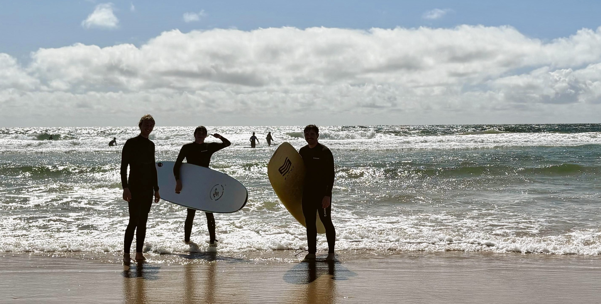

  

# 👋 Hi, I'm Francesco

🎓 MSc Statistics Student | 📊 Aspiring Data Scientist | 📍 Based in Padova, Italy  
🔗 [LinkedIn](https://www.linkedin.com/in/francescopagano24/) • 🌐 [Personal GitHub](https://github.com/francescopagano)

---

## 🧠 About Me

I'm Francesco, a Master’s student in Statistics passionate about using data to solve real-world problems in business, finance, and healthcare.  
I enjoy working on projects involving **machine learning**, **data mining**, **high-dimensional data**, and **statistical modeling**.  
During my studies, I’ve worked with various datasets—ranging from commodity prices to medical imaging—and I’m always open to collaborating on meaningful data-driven projects.

- 💻 Experienced in **Python**, **R**, **SQL**, **SPSS**
- 🧰 Tools: `scikit-learn`, `pandas`, `keras`, `ggplot2`, `Jupyter`, `Looker`
- 🌍 Erasmus Student at ISCTE Lisbon (2025)
- 📚 Currently learning: Deep Learning, Advanced ML, and Cloud-based Analytics

---

## 🧩 Projects

### 🔹 Aluminum Price Forecasting
**Keywords:** Time Series, Regression, Business Forecasting  
Analyzed and forecasted the trend of aluminum prices (2021–2023) using time series decomposition, ARIMA models, and ML regressors.  

### 🔹 [Gastrointestinal Lesion Classification](https://github.com/francescopagano)  
**Keywords:** Classification, High-Dimensional Data, Feature Selection  
Built and evaluated classifiers on a high-dimensional medical dataset. Focused on dimensionality reduction and performance under sparse signals.  

### 🔹 [Clustering Large Datasets: BFR vs CURE](https://github.com/francescopagano)  
**Keywords:** Big Data, Clustering, Distance Metrics  
Benchmarked two clustering algorithms for large datasets (BFR and CURE), testing scalability, robustness, and clustering accuracy.

---

## 🛠 Skills

- **Languages:** Python, R, SQL, SPSS  
- **Libraries/Tools:** Scikit-learn, Keras, Pandas, ggplot2, Jupyter, Looker  
- **Soft Skills:** Problem Solving, Communication, Teamwork, Adaptability  
- **Languages:** Italian 🇮🇹 (native), English 🇬🇧 (fluent), Spanish 🇪🇸 (beginner)

---

## 📬 Let's Connect

📧 francesco.pietro.pagano@gmail.com  
🌐 [LinkedIn](https://www.linkedin.com/in/francescopagano24/)  
💻 [GitHub](https://github.com/francescopagano)

---

_Thanks for visiting! Feel free to reach out if you want to collaborate on a data project, talk about statistics, or share a podcast recommendation._

